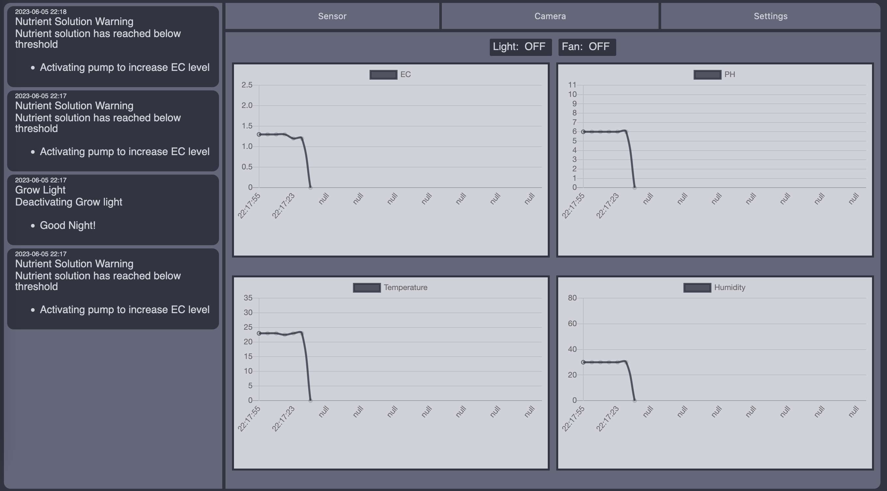
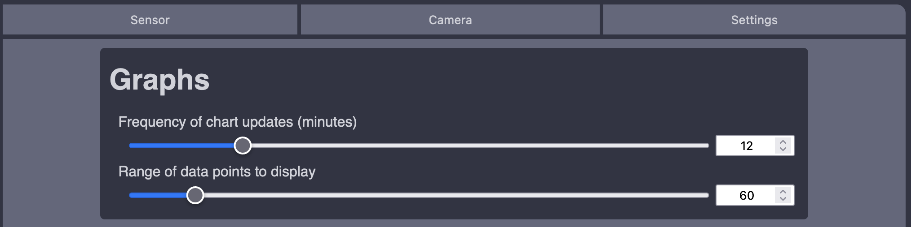
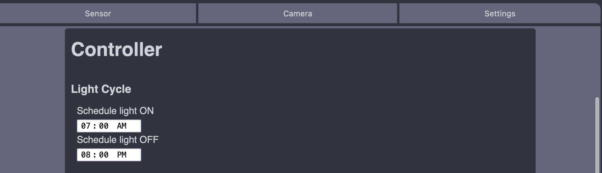
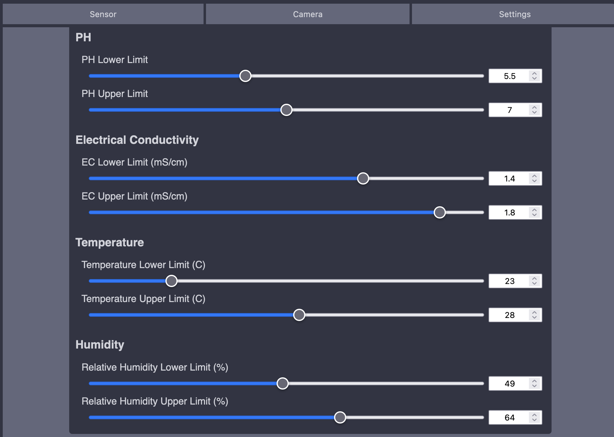

# AeroDoc
A tool developed in part of a research project for automating an aeroponics gardening system.

## Table of Contents
* [Quick Start](#quick-start)
* [What's included](#content)
* [Dependencies](#dependencies)
* [Building a System](#building-a-system)
* [Web Interface](#web-interface)
* [Credits](#credits)

## Quick Start
1. Clone the Repository: `https://github.com/ethnelson/aerodoc.git`


2. If you don't plan on building a full system with a Raspberry Pi, you can run the system with a built in simulator. Simply run `make setup`

3. Run `make run`

4. Access `localhost:5000`
> You can change whether or not you want the web-interface to be accessible by other machines in your network. In **appflask.py** change `app.run()` => `app.run(host='0.0.0.0')`

5. In the web-interface, you change system settings such as PH range, EC range, time of light cycles, etc.

If you plan on building the system, take a look at [Building a System](#building-a-system)

## Content
Included in this repository are the scripts, web-interface resources,
configuration file, Flask App file, and Readme.

```
AeroDoc
├── LICENSE
├── Makefile
├── README.md
├── aerodoc.ini
├── appflask.py
├── requirements.txt
├── scripts
│   ├── arduino_code
│   ├── arduino_comms.py
│   ├── comms_emulate.py
│   ├── controller.py
│   ├── notes.txt
│   └── setup.py
├── static
│   ├── css
│   │   └── template.css
│   ├── img
│   │   ├── 501_error.png
│   │   └── aerodoc.svg
│   └── js
│       ├── Chart.bundle.min.js
│       ├── jquery.min.js
│       └── main.js
└── templates
    ├── camera.html
    ├── sensors.html
    ├── settings.html
    └── template.html
```

## Dependencies
* Python

## Building a System
To begin building the automated portion of the Aeroponics System, a view things are required.
* Raspberry Pi
* Arduino
---
* Gravity EC Sensor
* Gravity PH Sensor
* Gravity Temperature & Humidity Sensor
* Water level sensor
* 3 Peristaltic Pumps
* Fan
* Grow light (able to be controlled by Arduino)
> Note: none of these specific components are required. However, if you would like to interchange parts, making changes to the **scripts/arduino_code** file is required.

---
In accordance with the default **arduino_code** file, this is the layout of the Arduino.
> Note the Serial Clock & Serial Data are used for the Humidity & Temperature Sensor


> Also note that the Peristaltic pumps require transistors to actuate.

Once the Arduino side is completed, upload the **arduino_code** to the Arduino (after making any required changed). Then connect the Raspberry Pi to the Arduino through a USB connection.

After piecing the hardware together, you can clone over the repository to the Raspberry Pi. (I recommend setting up the Raspberry Pi with SSH enabled as well). Follow the next steps to setup the web-interface.
1. In **appflask.py** change `app.run()` => `app.run(host='0.0.0.0')` to allow access to other local machines.
2. Run `make setup`
3. Run `make run`
4. Connect to the web-interface on the Raspberry Pi's IP: 192.168... :5000

## Web Interface
Once you open the web-interface, you'll be greeted with a view of several charts and a notification feed.
> 

This web interface has a range of settings that can be configured for this system including:
1. Camera settings
    > 
2. Graph Settings
    > 
3. Light Cycle Settings
    > 
4. Various Threshold Settings
    > 


## Credits
* Ethan Nelson
* Advisor: Dr. Wallingford
